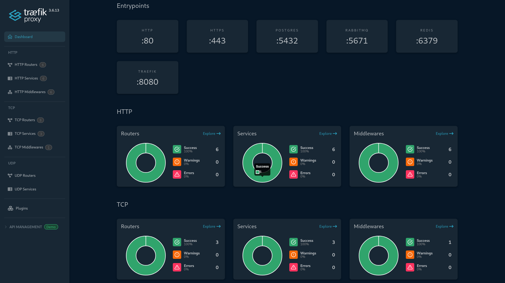

# Notification Service

Microservice for bulk SMS and Email notifications with traffic prioritization and delivery guarantee.



## Features

- Bulk SMS/Email notification sending.
- Traffic prioritization (urgent/normal) via separate RabbitMQ queues.
- Detailed delivery status tracking: queued → sent → delivered/failed.
- Delivery guarantee (at-least-once) with retry mechanisms.
- Message deduplication (idempotency) via fingerprint + two-level lock (Redis + PostgreSQL).
- UUID v7 primary keys.
- TimescaleDB for status journal with automatic partitioning.
- Laravel Pipeline (Process/Handler pattern) for message processing.
- Mock providers for SMS and Email with error simulation.
- Integration tests for main scenarios.
- Full TLS encryption.

## Tech Stack

| Component        | Version     | Purpose                  |
| ---------------- | ----------- |------------------------- |
| **PHP**          | 8.5         | Backend runtime          |
| **Laravel**      | 13.x        | Framework                |
| **TimescaleDB**  | 2.25.2-pg18 | PostgreSQL + Time-series |
| **Redis**        | 8.2.3       | Cache & Sessions         |
| **Traefik**      | v3.6.13     | Reverse proxy + TLS      |
| **KrakenD**      | 2.10.2      | API Gateway              |
| **PHPStan**      | Latest      | Static analysis          |
| **Rector**       | Latest      | Code modernization       |
| **PHP CS Fixer** | Latest      | Code style               |

## Performance Highlights

- OPcache: Enabled with 128MB memory
- Redis caching via pipeline
- PostgreSQL indexes: GIN trigram + B-tree
- TLS 1.3: 2048-bit RSA keys, DH params

## Database Extensions

TimescaleDB 2.25.2-pg18 + extensions:

```
uuid-ossp, pgcrypto, pg_trgm, btree_gin, timescaledb, vector, btree_gist, unaccent
```

## Quick Start

### Prerequisites

- Docker & Docker Compose installed
- Bash (for cert script)
- OpenSSL (for make generate-secrets)
- Optional: g++ (if not available, an alternative method is provided)

### 1. Generate SSL Certificates

```
$ bash ./certgen.sh
```

### 2. Prepare Environment & Secrets

```
# Copy environment template
cp .env.example .env

# Generate strong random passwords
make generate-secrets

# Paste the output into your .env file (DB_PASSWORD, RABBITMQ_DEFAULT_PASS)
nano .env
```

### 3. Build and Start Containers

```
$ make build
```

The build target automatically:

- Creates the app-network Docker network
- Sets up Trivy cache (20× faster security scans: 42s → 2s)
- Validates .env file exists

If you don't have g++, run Docker Compose manually:

```
$ docker network create app-network
$ docker compose \
  -f docker-compose.yml \
  -f vendor/docker-compose.traefik.yml \
  -f vendor/docker-compose.krakend.yml \
  -f vendor/docker-compose.postgres.yml \
  -f vendor/docker-compose.redis.yml \
  -f vendor/docker-compose.rabbitmq.yml \
  -f vendor/docker-compose.queue.yml \
  -f vendor/docker-compose.swagger.yml \
  up --build -d --remove-orphans
```

### 4. Install Composer Dependencies

```
$ docker compose exec app composer install --prefer-dist --optimize-autoloader
```

### 5. Generate Application Keys

```
$ docker compose exec app php artisan key:generate
```

### 6. Run Database Migrations & Seeders

```
$ docker compose exec app php artisan migrate:fresh --seed
```

### 7. Verify Security Scan

```
$ make security-scan  # Runs Trivy in ~2 seconds with cache
```

### 8. Makefile Commands

| Command               | Description                                                      |
| --------------------- | ---------------------------------------------------------------- |
| make build            | Build and start containers (auto setup Trivy cache + validation) |
| make start            | Start existing containers                                        |
| make stop             | Stop and remove containers + volumes                             |
| make restart          | Restart all containers                                           |
| make security-scan    | Run Trivy vulnerability scan only                                |
| make generate-secrets | Generate strong random passwords (DB, RabbitMQ)                  |
| make clean            | Full Docker cleanup (containers, images, volumes, networks)      |
| make help             | Show all available commands                                      |

Override user IDs (for file permissions):

```
$ make build USER_ID=1000 GROUP_ID=1000
```

### Security & Auth

| Endpoint                      | Service        | Auth                             |
| ----------------------------- | -------------- | -------------------------------- |
| https://localhost/docs/       | **Swagger UI** | `swagger:jHOo4gcWzuKDTMbfPezU`   |
| https://localhost/monitorin   | **Telescope**  | `telescope:YU3N4O6VdDERC580tG1H` |

## License

This project is licensed under the [MIT License](https://opensource.org/licenses/MIT).
